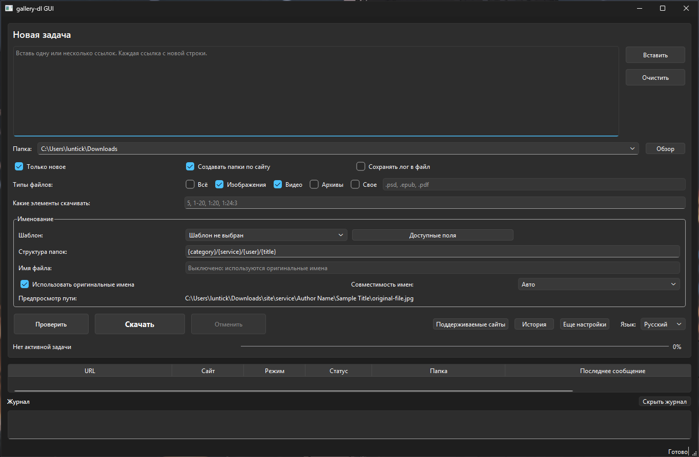

<a id="english"></a>

# gallery-dl Windows GUI

Windows GUI for [`gallery-dl`](https://github.com/mikf/gallery-dl) with a portable Windows build.

[English](#english) | [Русский](#russian)

The portable release already includes `gallery-dl`, so end users do not need to install the original CLI separately.

## What is this program?

`gallery-dl Windows GUI` is a desktop interface for Windows built on top of `gallery-dl`.
Its goal is simple: make downloading from supported websites easier for people who do not want to work from the command line.

Instead of assembling commands by hand, you can paste one or more URLs, choose a destination folder, configure file filters and naming rules, and run downloads from a visual interface.



## What is gallery-dl?

[`gallery-dl`](https://github.com/mikf/gallery-dl) is an open-source command-line downloader for many websites that host images, videos, posts, galleries, and similar media content.
It supports a large list of extractors, flexible file and folder naming templates, filtering, cookies and authentication, and many advanced download options.

## What is it for?

This program is useful for:

- download one URL or many URLs in a queue;
- work with websites supported by `gallery-dl` through a GUI instead of CLI commands;
- control folder structure and file naming templates;
- review supported sites directly in the app;
- run a ready-made portable Windows build without installing `gallery-dl` separately.

## AI-generated code

All code in this repository was generated by AI.

## Functions and features

- Main download screen with URL input, task queue, current task banner, and live log output.
- Destination folder history with a dropdown of recently used paths.
- File type filters for `All`, `Images`, `Videos`, `Archives`, and custom extensions.
- Naming templates with a live path preview before download starts.
- `Available fields` browser for naming templates, with explanations and quick insertion into folder or filename templates.
- `Supported sites` side panel that loads and caches the supported-sites list from the official `gallery-dl` GitHub repository.
- `More settings` side panel for access, filters, post-processing, app/network settings, and expert options.
- Separate `History` window with a clear action.
- Optional per-task log files.
- Russian and English interface languages.
- Portable Windows EXE build for end users.

## For developers

### Setup

```powershell
py -3 -m venv .venv
.\.venv\Scripts\Activate.ps1
py -3 -m pip install -U pip
py -3 -m pip install -e .[build]
```

### Run from source

```powershell
.\run_gui.cmd
```

Or directly:

```powershell
.\.venv\Scripts\python.exe .\main.py
```

### Build EXE

```powershell
.\build_exe.cmd
```

### Build portable release ZIP

```powershell
.\build_release.cmd
```

### Branch model

- `main` contains the stable version.
- New development can continue in a separate test branch when needed, but releases are published from `main`.

## Limitations

- Tasks run one after another, not in parallel.
- The GUI does not expose every `gallery-dl` option yet.
- Some advanced `gallery-dl` controls still live in expert-oriented settings instead of dedicated GUI widgets.

---

<a id="russian"></a>

# gallery-dl Windows GUI

Графический интерфейс для Windows поверх [`gallery-dl`](https://github.com/mikf/gallery-dl) с portable-сборкой для обычного запуска.

[English](#english) | [Русский](#russian)

В готовый portable-релиз `gallery-dl` уже включен, поэтому пользователю не нужно отдельно устанавливать оригинальную CLI-утилиту.

## Что это за программа?

`gallery-dl Windows GUI` — это настольный интерфейс для Windows, построенный поверх `gallery-dl`.
Его задача простая: сделать загрузку с поддерживаемых сайтов понятной для тех, кто не хочет работать через командную строку.

Вместо ручного набора команд можно вставить одну или несколько ссылок, выбрать папку сохранения, настроить фильтры и шаблоны именования и запустить загрузку из обычного окна программы.

## Что такое gallery-dl?

[`gallery-dl`](https://github.com/mikf/gallery-dl) — это open-source загрузчик командной строки для большого числа сайтов с изображениями, видео, постами, галереями и другим медиаконтентом.
Он поддерживает множество extractors, гибкие шаблоны имен файлов и папок, фильтрацию, cookies и авторизацию, а также большой набор продвинутых параметров загрузки.

## Для чего нужна?

Программа подходит для:

- скачивать одну ссылку или сразу несколько ссылок в очереди;
- работать с поддерживаемыми сайтами `gallery-dl` через GUI, а не через CLI-команды;
- управлять структурой папок и шаблонами имен файлов;
- просматривать список поддерживаемых сайтов прямо внутри программы;
- запускать готовую portable-версию под Windows без отдельной установки `gallery-dl`.

## Код сгенерирован ИИ

Весь код этого репозитория сгенерирован ИИ.

## Функции и особенности

- Главный экран загрузок с полем ссылок, очередью задач, баннером текущей задачи и живым журналом.
- История папок назначения с выпадающим списком последних путей.
- Фильтры по типам файлов: `Всё`, `Изображения`, `Видео`, `Архивы` и пользовательские расширения.
- Шаблоны именования с живым предпросмотром итогового пути еще до запуска загрузки.
- Окно `Доступные поля` для шаблонов именования с пояснениями и быстрой вставкой в шаблон папки или имени файла.
- Боковая панель `Поддерживаемые сайты`, которая загружает и кэширует список сайтов из официального GitHub-репозитория `gallery-dl`.
- Боковая панель `Еще настройки` с разделами для доступа, фильтров, постобработки, настроек приложения/сети и параметров для опытных пользователей.
- Отдельное окно `История` с кнопкой очистки.
- Необязательное сохранение логов задач в отдельные файлы.
- Русский и английский языки интерфейса.
- Portable EXE-сборка для Windows.

## Для разработчиков

### Установка

```powershell
py -3 -m venv .venv
.\.venv\Scripts\Activate.ps1
py -3 -m pip install -U pip
py -3 -m pip install -e .[build]
```

### Запуск из исходников

```powershell
.\run_gui.cmd
```

Или напрямую:

```powershell
.\.venv\Scripts\python.exe .\main.py
```

### Сборка EXE

```powershell
.\build_exe.cmd
```

### Сборка portable ZIP

```powershell
.\build_release.cmd
```

### Модель веток

- `main` хранит стабильную версию.
- Новая разработка может продолжаться в отдельной тестовой ветке по мере необходимости, но релизы публикуются из `main`.

## Ограничения

- Задачи выполняются по очереди, а не параллельно.
- Интерфейс пока покрывает не все возможности `gallery-dl`.
- Часть продвинутых настроек `gallery-dl` все еще находится в блоке для опытных пользователей, а не в отдельных специализированных элементах GUI.
